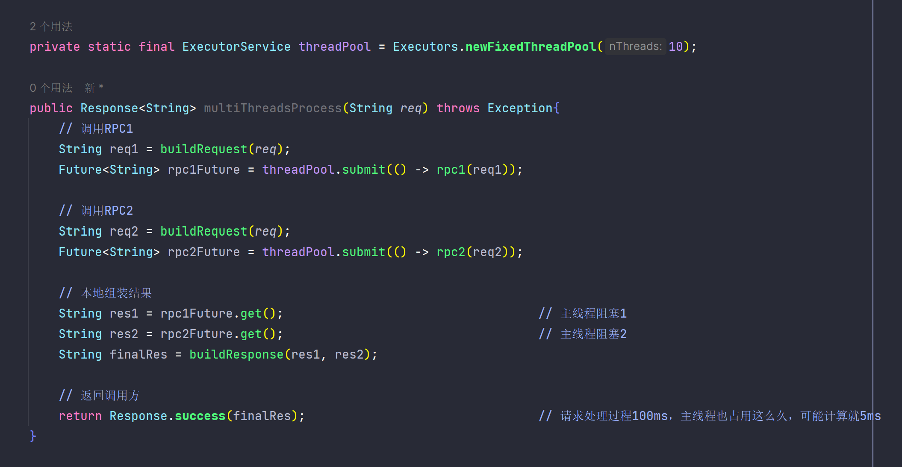
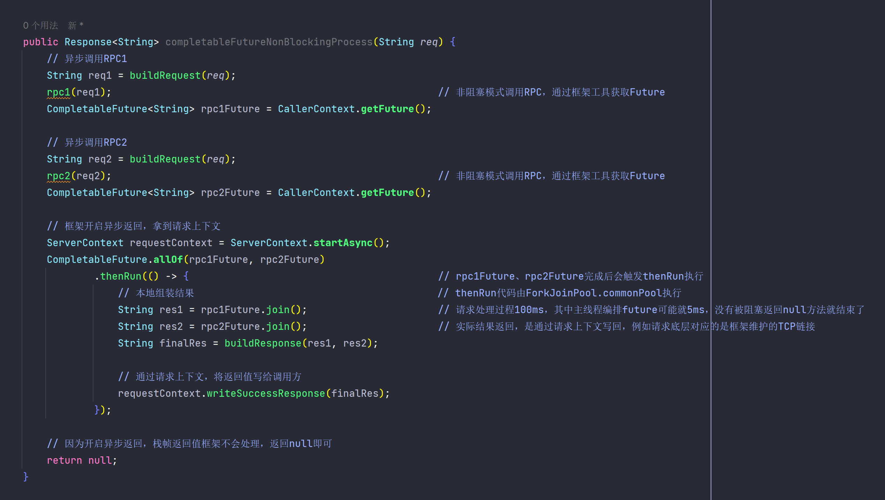

# 浅谈异步编程
## 线程池编程的挑战
在Java并发编程中，通常会使用线程池提交若干子任务做多线程并发执行，然后同步多个Future聚合最终结果，这种方式在需求开发中
很常见，也确实行之有效。
不过，使用线程池多线程并发，始终绕不开线程池参数设置，例如coreSize、maxSize、阻塞队列、拒绝策略的选择， 这里为选择困
难症的同学发个声，难度不亚于命名。

- 线程数关乎并发度大小，最终影响吞吐量。理想情况下，4个线程=4并发度，单线程处理任务如果耗时100ms，
那么线程池的吞吐量 = 并发度 * 单个线程吞吐量 = 4 * 1s / 100ms = 40 TPS。
- 阻塞队列大小也是个问题，设置过大可能导致任务饥饿超时。假如coreSize设4个线程，阻塞队列大小设置1000，
maxSize设8个线程，单线程处理耗时还是100ms。当线程池水位在40TPS以上时，coreSize处理不过来的任务，会进阻塞队列排队等
待，我们知道如果队列满了，则会释放coreSize~maxSize的线程提高处理速度。但是，这部分线程也可能无法及时介入导致饥饿超时，
例如在50TPS时，每秒都有10个任务处理不完，进入阻塞队列，打满阻塞队列简单估算需要1000 / 10 = 100s，另外假设任务3s超时，
则队列排队量在120个（超时时间 * 此时吞吐量）之后的部分会出现饥饿超时，此时才过12s新线程还没有开始释放。
- 拒绝策略，曾排查过一个RPC线程池报RejectException的线上问题，当时服务没有突发流量，也没有近期上线过相关改动，最后定
位到有个RPC触发的定时任务，会提交给一个小线程池处理任务逻辑，因为业务问题任务一直超时，且超时时间设置不合理会阻塞线程
数分钟，使得超时阻塞>定时周期打满了小线程池（预期是不会打满的），导致问题发生的直接原因是其自定义拒绝策略：阻塞调用方线
程直到队列有空位，相当于RPC可用线程会被定时任务周期性阻塞减员，最终服务整体性能下降产生RejectException故障。

针对上述问题，业界有一种解决方案是使用
[动态线程池](https://tech.meituan.com/2020/04/02/java-pooling-pratice-in-meituan.html)，允许参数动态化配
置，辅以细粒度的线程池监控和告警，在管理后台可以方便地调整线程池，即时生效。
其实除了参数和监控问题，线程池也带来了很多别的问题，像是不同的业务场景线程池是否要做隔离？使用大量的线程池如何治理？有的
线程池线程忙不过来任务会排队等待，这时有的线程池有空闲线程缺无法提供帮助，JVM全局线程数一看都1000上下了，这可咋整？

会有什么其他解法吗？不如先放下线程池多线程编程，换个思路看看，比如常用的Redis、Nginx使用单线程模型，并发性能都很不错，
这是怎么做到的？接下来我们聊聊事件驱动。

## 异步解法：事件驱动
先引入一个概念：callback，很多人或多或少听说过回调地狱（callback hell）这个词，callback是什么，调用方法时候把一段
代码包成入参也传进去执行，这个代码片段就是callback，其实callback隐含着一个想法：我们一定要通过return的方式，处理
并传递数据吗？

对线程来说，是否return会有很大的区别。先看看return方式，我们的服务之所以要用线程池开多线程处理并发，是因为请求和线程
是1:1绑定的，这种绑定体现在请求处理逻辑实现需要通过return弹出线程栈帧传递数据，处理过程中如遇到HTTP或是RPC等网络IO
方法调用，线程会同步阻塞等待IO结果return，同理整个请求处理流程通过中间各种方法return最终处理完成，处理结果也会return
到框架的某段代码，将结果写入调用方的网络流（像TCP链接）。观察这种请求处理过程，线程可能实际工作间很少，大部分都是在等待
IO或是其他原因阻塞了，因为等待时间客观存在，所以线程利用率并不高。例如线程池有10个可用线程，这时同时来了11个任务，
其中10个任务会立即执行，但会剩1个任务进阻塞队列等待任务处理完成的线程，这个任务的RT就得算上排队时间，哪怕那10个线程
耗时100ms = 计算5ms + IO等待95ms，处于IO等待的阻塞态线程也是爱莫能助，必须当前任务处理完才能处理下一个。只能通过加线程
的方法提高性能，可操作系统的线程数是有上限的，1000个线程（栈1M）能吃掉差不多1G的内存，更不用说线程多了CPU调度的时间片成本
也会猛增，因此面对C10K问题，这种同步阻塞的多线程模型很吃力。

再看看调用方法不return的方式，直接把原来处理调用方法return结果的代码，包装成callback函数传入调用方法，此时方法可以是
void的，在调用方法逻辑完成后，其内部再触发这个callback函数，就实现了和上面return后处理相同的逻辑，这种技巧学名叫
CPS变换（Continuation-Passing Style），感兴趣的同学可以阅读这篇文章
[异步与回调的设计哲学](https://juejin.cn/post/6844903465374760973)。把请求处理过程切分成若干代码片段，不用return了，
改用callback函数包装再嵌套处理，虽然逻辑是一样，可这有啥好处吗？可读性明显下降了也不利于理解，其实这么做的目的是可以解耦
请求和线程的关系，一个请求的处理过程可能会在ThreadA、ThreadB、ThreadC上各执行一部分代码片段（callback函数）最终完成，
好处是线程不必阻塞等待结果再做后续处理了，它已经把后续处理过程作为callback提供出去了，这样就做到了非阻塞，同样100ms的处理过程，
ThreadA计算3ms然后也不等那IO的95ms了，又可以抽出来去处理其他的请求，等IO完成后会再触发callbackA实现后续2ms计算处理，
请求处理过程还是100ms。这里提一下IO完成再触发callbackA的细节，通常框架会提供NIO接口，底层走的例如可能是Linux epoll，
可注册回调函数在框架NIO完成时，由框架的回调线程触发执行callbackA，如果想让ThreadX处理后续逻辑，可以在NIO接口回调函数
写ThreadX.submit(() -> callbackA())， 这样就能转移后续逻辑的处理线程了。这种基于事件触发callback执行，串联请求处理过程的方法，
就是事件驱动，可以看到其主要是通过解耦请求和线程的关系，实现了非阻塞异步处理，相比同步阻塞方式极大提高了线程利用率，确实用
少量线程就可以支撑大量请求，有着不错的Scalability，再次引用Redis和Nginx的例子，非常给力！

## Java8：CompletableFuture
了解事件驱动这种异步思想之后，可以聊聊CompletableFuture，Java8提供的异步工具，相比callback嵌套组织代码的区别，上节引用的文章
[异步与回调的设计哲学](https://juejin.cn/post/6844903465374760973) 已经讲的很清楚了，不再赘述，我个人理解是
将多层嵌套的callback，通过Future/Promise抽象后打平为一层，变成链式调用了，优化了异步代码可读性。

**举例来说，一个请求的处理，需要调用两个rpc完成，线程池多线程编程如下图：**

**换用CompletableFuture，结合框架提供的非阻塞功能，实现异步编程：**

实战案例亦可参考 [CompletableFuture原理与实践-外卖商家端API的异步化](https://tech.meituan.com/2022/05/12/principles-and-practices-of-completablefuture.html)